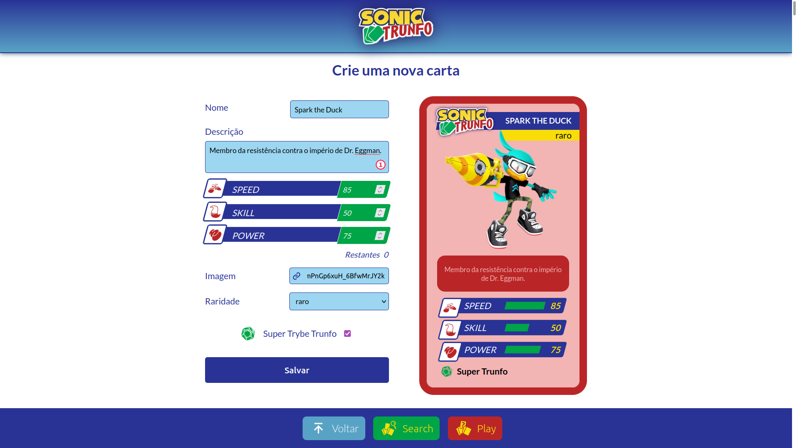

# :black_joker: Sonic Trumps (_Trunfo_ in Portuguese) :black_joker:

## :page_with_curl: About

React project developed by [Raphael Martins](https://www.linkedin.com/in/raphaelameidamartins/) at the end of Unit 11 ([Front-end Development Module](https://github.com/raphaelalmeidamartins/trybe_exercicios/tree/main/2_Desenvolvimento-Front-end)) of Trybe's Web Development course. I was approved with 100% of the mandatory and optional requirements met.

We had to develop a _Top Trumps_-style card game application by manipulating the components' states and props.

Special thanks to [Nibroc-Rock](https://www.deviantart.com/nibroc-rock) who allowed me to use his 3D artwork in the cards.

[Click here](https://raphaelalmeidamartins.github.io/sonic-trumps) to check out the final version of the project on your browser.

### Note

This project is still under development, I'm working on it in my free time. The mobile version isn't as optimized as the desktop and tablet versions yet. It doesn't work properly on devices with smaller screens.

### In progress

- [ ] Implementing integration tests with React Testing Library
- [ ] Improving the mobile version
- [ ] Adding English translation (the project is currently only available in Brazilian Portuguese)
- [ ] I still need to implement how the Top Trump/Super Trunfo attribute influences the game.

## :man_technologist: Developed Skills

* Develop a React application
* Create and reuse React components
* React to user interactions by manipulating the components' states and props according to user events

## :memo: Methodologies

* Mobile First

## :hammer_and_wrench: Tools

* HTML5
* CSS3
* JavaScript ES6+
* React.js
* React Testing Library (RTL)
* React Icons (icon library)
* GitHub Pages

## :iphone: Mobile version

## :trophy: Grade

### :copyright: Copyright disclaimer

The Sonic the Hedgehog franchise and characters belong to Sega, all rights reserved. I developed this project for learning purposes, it's not related to the company. Most of the 3D renders artwork in the cards were designed by [Nibroc-Rock](https://www.deviantart.com/nibroc-rock), some of them are official artwork from the games, though.
