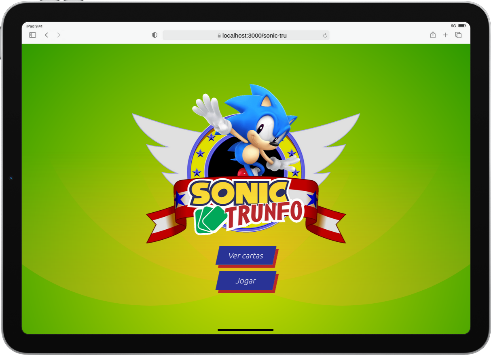

# :black_joker: Sonic Trumps (_Trunfo_ em Português) :black_joker:

## :page_with_curl: About/Sobre

  
<strong>:us: English</strong>

React project developed by [Raphael Martins](https://www.linkedin.com/in/raphaelameidamartins/) at the end of Unit 11 ([Front-end Development Module](https://github.com/raphaelalmeidamartins/trybe_exercicios/tree/main/2_Desenvolvimento-Front-end)) of Trybe's Web Development course. I was approved with 100% of the mandatory and optional requirements met.

We had to develop a _Top Trumps_-style card game application by manipulating the components' states and props.

Special thanks to [Nibroc-Rock](https://www.deviantart.com/nibroc-rock) who allowed me to use his 3D artwork in the cards.

[Click here](https://raphaelalmeidamartins.github.io/sonic-trumps) to check out the final version of the project on your browser.

#### Note

Este projeto ainda está em desenvolvimento, estou implementando testes automatizados de integração

#### In progress/Em andamento

* Implementing integration tests with React Testing Library
* Adding English translation (the project is currently only available in Brazilian Portuguese)
* I still need to implement how the Top Trump/Super Trunfo attribute influences the game
* Reducing the complexity of the CreateCardForm and Input components

  
<strong>:brazil: Português</strong>

Projeto React desenvolvido por [Raphael Martins](https://www.linkedin.com/in/raphaelameidamartins/) ao fim do bloco 11 ([Módulo Desenvolvimento Front-end](https://github.com/raphaelalmeidamartins/trybe_exercicios/tree/main/2_Desenvolvimento-Front-end)) do curso de Desenvolvimento Web da Trybe. Fui aprovado com 100% dos requisitos obrigatórios e opcionais atingidos.

Tivemos que desenvolver uma aplicação de jogo no estilo _Super Trunfo_ manipulando os estados e propriedades dos componentes.

Agradecimento especial a [Nibroc-Rock](https://www.deviantart.com/nibroc-rock) que me autorizou utilizar suas artes 3D nas cartas.

[Clique aqui](https://raphaelalmeidamartins.github.io/sonic-trumps) para conferir a versão final do projeto no seu navegador.

#### Observação

Este projeto ainda está em desenvolvimento, estou implementando testes automatizados de integração

#### Em andamento

* Implementando testes automatizados de integração com a React Testing Library
* Adicionando tradução para o inglês (atualmente o projeto está disponível apenas em português brasileiro)
* Ainda preciso implementar como o atributo Super Trunfo influencia no jogo
* Reduzir a complexidade dos componentes CreateCardForm e Input

## :man_technologist: Developed Skills/Habilidades Desenvolvidas

* Develop a React application
* Create and reuse React components
* React to user interactions by manipulating the components' states and props according to user events
* Use the React Router library to handle page navigation
* Use the Redux library for state management

## :memo: Methodologies/Metodologias

* Mobile First

## :hammer_and_wrench: Tools/Ferramentas

* HTML5
* CSS3
* JavaScript ES6+
* React.js
* React Router v6
* Redux.js
* React Testing Library (RTL)
* React Icons (icon library)
* Sass
* GitHub Pages

## :iphone: Mobile version/Versão mobile

## :camera: Screenshots/Capturas de tela

## :trophy: Grade/Nota

### :copyright: Copyright disclaimer/Aviso de direitos autorais

The Sonic the Hedgehog franchise and characters belong to Sega, all rights reserved. I developed this project for learning purposes, it's not related to the company. Most of the 3D renders artwork in the cards were designed by [Nibroc-Rock](https://www.deviantart.com/nibroc-rock), some of them are official artwork from the games, though.
